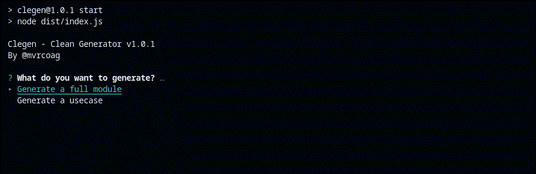
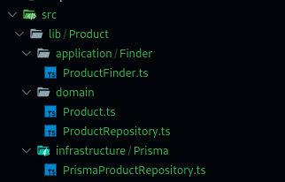

<div align="center">
  <br>
  <h1>Clegen 🧩</h1>
  <strong>Generate modules with clean architecture for Typescript projects</strong>
</div>
<br>

## What is Clegen?

Clegen (clean generator) is a command-line tool designed to scaffold clean architecture modules in TypeScript projects.

## Installation

Since clegen is not a package, you can use it directly with npx:

```bash
npx clegen@latest
```

## Usage
To use clegen, simply run the following command and follow the prompts to generate the scaffolding for a new module:

```bash
npx clegen@latest
```

The tool will guide you through the process of creating a new module, such as "User", and generate the necessary directory structure including domain, application, and infrastructure layers.

## Example
Here's an example of how you can use clegen to create a new "Product" module:



And the result:



## Contributing
Contributions to clegen are welcome! If you encounter any issues or have suggestions for improvements, please feel free to submit pull requests or open issues on the GitHub repository.

## License
This project is licensed under the MIT License.